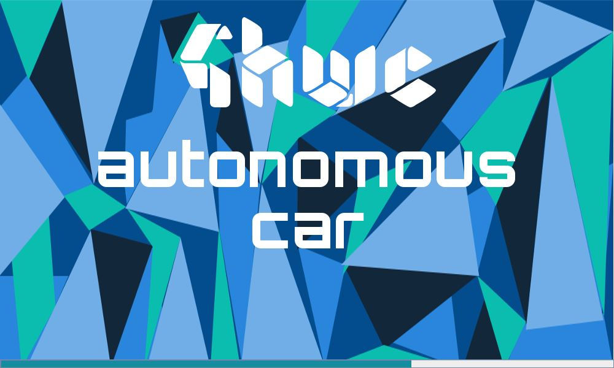

# 4HWCAutonomousCar

## 4HWC ?

4HWC est une multinationale aux missions variées. Notre objectif est d'améliorer les différents domaines de la vie quotidienne. Progressivement, nous travaillons au développement de nos activités et à une présence effective dans de nombreux pays. Actuellement, nous ne travaillons pas sur des projets à grande échelle. Nous mettons en place des prototypes qui seront améliorés plus tard.

# Site web 

https://4hwc4hwc.wixsite.com/4hwc

## Explications du projet AutonomousCar

A long terme, le but c'est de mettre sur pied, un véhicule se déplaçant de manière autonome dans une ville par exemple.

Pour l'instant, un logiciel a été mis sur pied.

Des améliorations sont à venir.

Prototype  de Véhicule Autonome

Visualiser en temps réel sur un écran le déplacement d’un véhicule de sa position initiale à sa position finale en fonction des instructions fournies et de son orientation à chaque instant sur une surface rectangulaire. Tout au long du processus, une intelligence artificielle sous forme vocale améliore l’expérience utilisateur.

Les 4 données suivantes sont nécessaires avant tout déplacement :

1) les dimensions de la surface

2) la position initiale du véhicule

3) l’orientation initiale (N (North) E (East)  W (West) S (South))

4) les instructions à suivre ( combinaison de 3 lettres A (Avancer) ; G (Tourner à Gauche) et D(Tourner à Droite))

Le logiciel présente 3 options au choix:

1) Visualiser les déplacements de 2 véhicules dont les paramètres initiaux sont au préalable définis dans un fichier.

2) Le nombre de véhicules et les paramètres initiaux sont définis par un utilisateur.

3) L’intelligence artificielle génère automatiquement le nombre de véhicules et les paramètres initiaux.

A la fin du parcours, chaque véhicule doit afficher sa position et son orientation finales.

Voici des captures d'écran du projet ---> https://drive.google.com/open?id=1wbKSHlvNHx9uD-yMiw7ZG2IrK9dOw3QC

