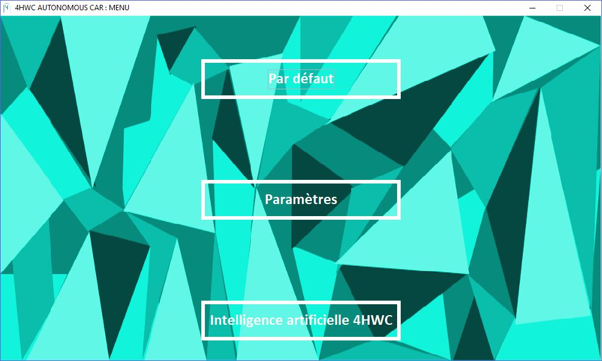
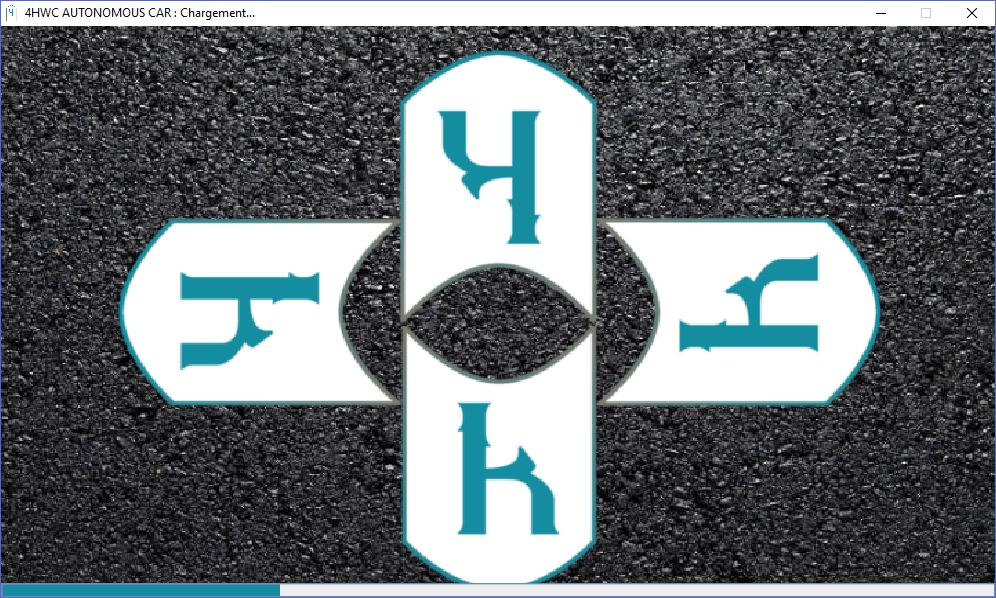
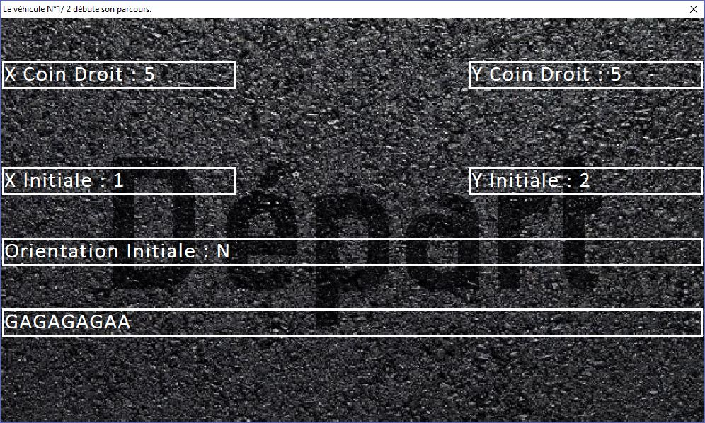
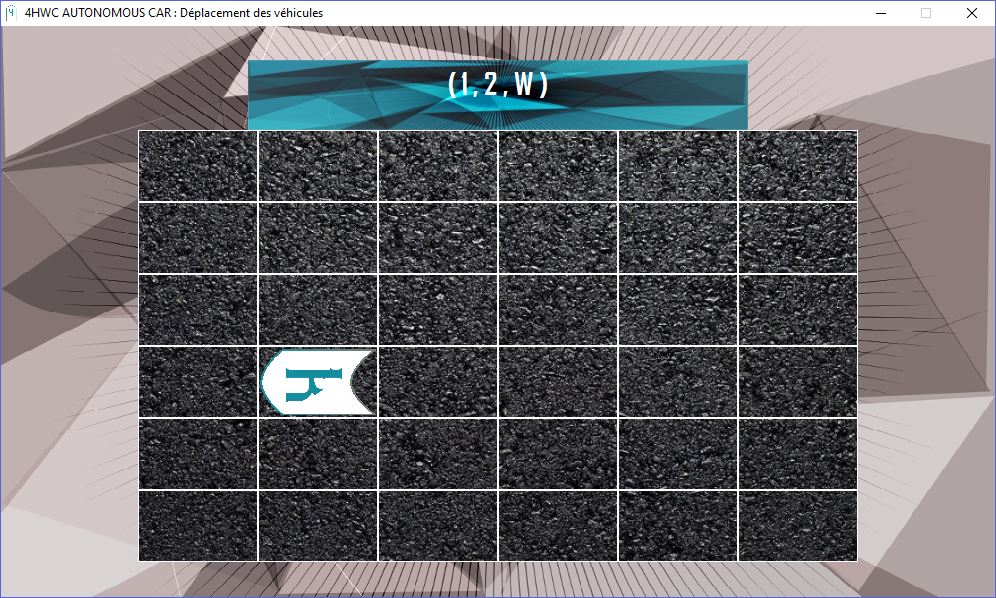
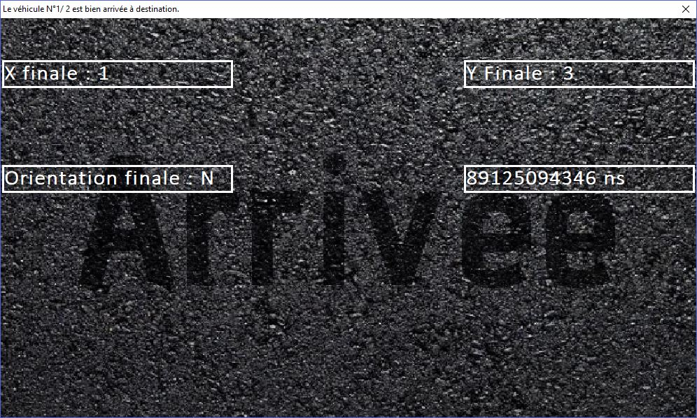
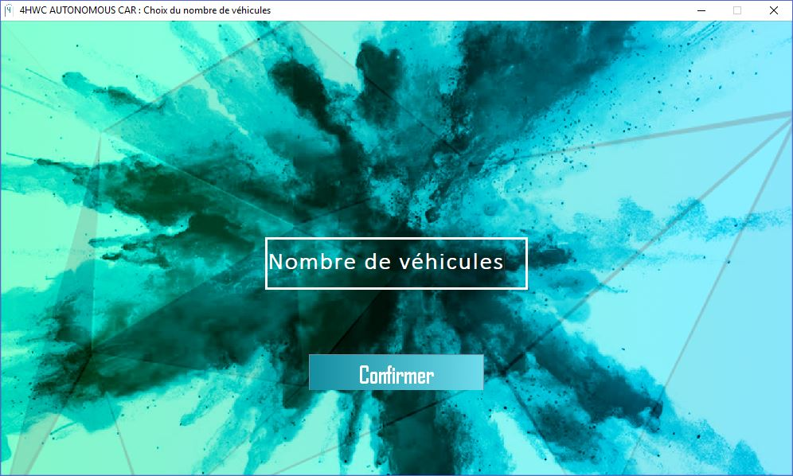
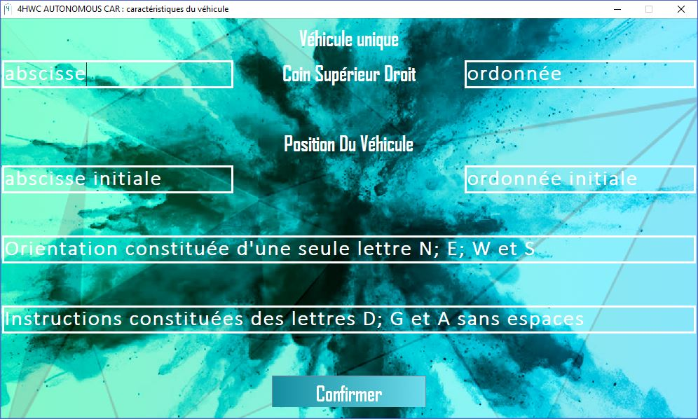
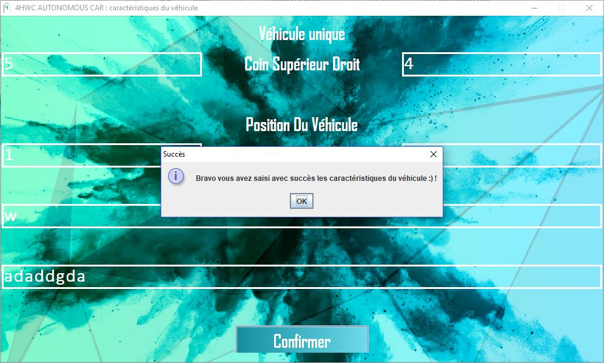
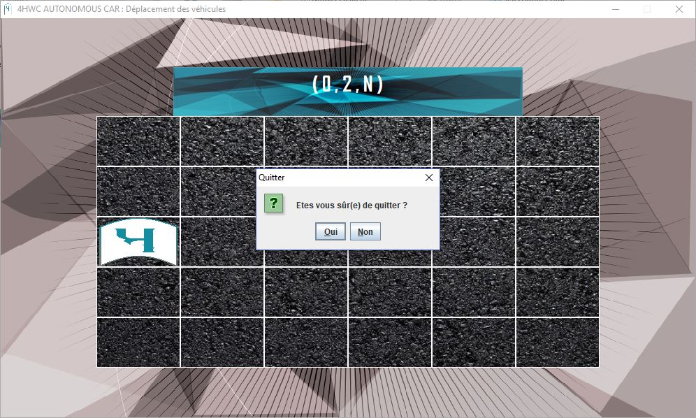

# 4HWCAutonomousCar

The goal is to set up a vehicle moving autonomously.

To achieve that goal, we are developing a simulation software : **Prototype of Autonomous Vehicle**

Visualize in real time on a screen the movement of a vehicle from its initial position to its final position according to the instructions provided and its orientation at each moment on a rectangular surface. Throughout the process, an artificial intelligence (voice) improves the user experience.

The following  data are needed before moving:

1) surface dimensions

2) vehicle's initial position

3) initial orientation (N (North) E (East) W (West) S (South))

4) instructions to follow (combination of 3 letters A (Move Forward); G (Turn Left) and D (Turn Right))

**NOTE :** French translations -> A (Avancer) G (Gauche) D(Droite)

The software has 3 options to choose from:

1) View the movements of 2 vehicles whose initial parameters are previously defined in a file.

2) The number of vehicles and the initial parameters are defined by a user.

3) Artificial intelligence automatically generates the number of vehicles and the initial parameters.

At the end, each vehicle must display its final position and orientation.

Screenshots : 

